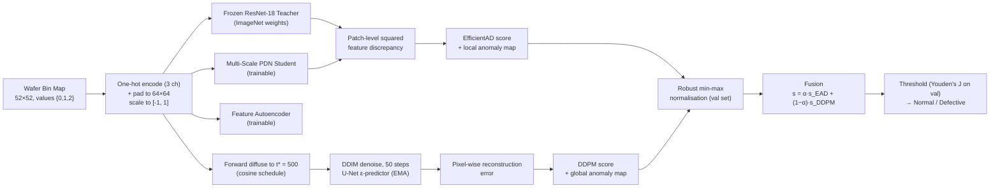

# Hybrid EfficientAD + DDPM Framework for Wafer Bin Map Defect Detection


-6f42c1)


A hybrid, unsupervised anomaly-detection framework for semiconductor **Wafer Bin Maps (WBMs)**. It pairs a **structural** detector (an EfficientAD-style student–teacher network) with a **generative** detector (a denoising diffusion probabilistic model) and fuses their anomaly scores, so that both *local* defects (scratches, edge irregularities, localized clusters) and *global / logical* defects (spatially invalid combinations of otherwise normal-looking patterns) are covered by a single model.

The framework is trained **only on defect-free wafers** and evaluated on all 37 single- and mixed-type defect classes of the WM-38K dataset. Every number in this README is computed live by the notebook — nothing is hard-coded to match a target.

---

## Table of Contents

- [Key Results](#key-results)
- [Why a Hybrid Approach?](#why-a-hybrid-approach)
- [Framework Overview](#framework-overview)
- [Dataset](#dataset)
- [Method](#method)
  - [Preprocessing](#preprocessing)
  - [Module 1 — EfficientAD (Structural)](#module-1--efficientad-structural)
  - [Module 2 — DDPM (Generative)](#module-2--ddpm-generative)
  - [Score Normalisation, Thresholding and Fusion](#score-normalisation-thresholding-and-fusion)
- [Results](#results)
  - [Main Results with 95% Confidence Intervals](#main-results-with-95-confidence-intervals)
  - [Statistical Significance](#statistical-significance)
  - [Ablation — Fusion Weight α](#ablation--fusion-weight-α)
  - [A Note on Interpreting the Metrics](#a-note-on-interpreting-the-metrics)
- [Figure Gallery](#figure-gallery)
- [Getting Started](#getting-started)
- [Configuration](#configuration)
- [Repository Structure](#repository-structure)
- [Limitations and Future Work](#limitations-and-future-work)
- [References](#references)
- [Citation](#citation)
- [License](#license)

---

## Key Results

Test set: **18,658 wafers** (18,508 defective / 150 normal), never seen during training.

| Model | AUROC | Avg. Precision | F1 | MCC | Balanced Acc. |
|---|---|---|---|---|---|
| EfficientAD (structural) | 0.9799 | 0.9998 | 0.9604 | 0.2781 | 0.9288 |
| DDPM (generative) | 0.9931 | 0.9999 | 0.9764 | 0.3620 | 0.9538 |
| **Hybrid Fusion (α = 0.5)** | **0.9985** | **1.0000** | **0.9830** | **0.4321** | **0.9800** |

- The fused model beats **both** individual modules on every metric.
- The improvement is statistically significant under a paired bootstrap test, the DeLong test, and McNemar's test (all *p* < 0.001).
- An α-sweep confirms that equal weighting (α = 0.5) is the AUROC-optimal fusion weight; neither module alone (α = 0 or α = 1) comes close.

---

## Why a Hybrid Approach?

Wafer defects come in two broad flavours, and each is caught best by a different kind of model:

| Defect type | Example | What catches it | Module |
|---|---|---|---|
| **Structural / local** | Scratch, edge-localised cluster, local spot | A patch looks different from any normal patch | EfficientAD — patch-level teacher–student feature discrepancy |
| **Logical / global** | Unusual *combination* of patterns that individually look normal | The wafer as a whole is unlikely under the normal distribution | DDPM — reconstruction error after partial noising and denoising |

Combining a **local anomaly map** with a **global anomaly score** gives full-spectrum coverage of WBM defects.

---

## Framework Overview



---

## Dataset

**MixedWM38 / WM-38K** — mixed-type wafer defect dataset ([Kaggle mirror](https://www.kaggle.com/datasets/co1d7era/mixedtype-wafer-defect-datasets)).

| Property | Value |
|---|---|
| Total wafers | 38,015 |
| Map size | 52 × 52 |
| Pixel values | 0 = blank (outside die), 1 = normal die, 2 = broken die |
| Labels | 8-bit multi-label vector → 38 classes |
| Base defect patterns | Center, Donut, Edge-Loc, Edge-Ring, Loc, Near-Full, Scratch, Random |
| Mixing degree | 0 (normal): 1,000 · 1: 7,015 · 2: 13,000 · 3: 13,000 · 4: 4,000 |

**Anomaly-detection framing.** Class **C01 (Normal)** is the only "in-distribution" class. All other 37 classes (8 single-type + 29 mixed-type) are treated as **defective** at test time. This makes the task strictly one-class: no defect example is ever used for training.

**Data split.**

| Split | Total | Normal | Defective | Used for |
|---|---|---|---|---|
| Train | 700 | 700 | 0 | Training both modules |
| Validation | 18,657 | 150 | 18,507 | Score normalisation, threshold selection, α-sweep threshold |
| Test | 18,658 | 150 | 18,508 | All reported metrics |

The 1,000 normal wafers are split 70 / 15 / 15; the 37,015 defective wafers are split 50 / 50 between validation and test. Seed = 42 throughout.

---

## Method

### Preprocessing

1. **Spatial one-hot encoding** — each 52 × 52 map is turned into three binary channels: *blank*, *normal die*, *broken die*. This removes the false ordinal relationship between pixel values 0/1/2.
2. **Padding** — 6 pixels of zero padding on each side → **3 × 64 × 64**.
3. **Scaling** — values mapped from [0, 1] to [−1, 1] (the standard diffusion input range). For the ImageNet teacher, inputs are mapped back to [0, 1] and ImageNet-normalised.

### Module 1 — EfficientAD (Structural)

A student–teacher architecture in the spirit of EfficientAD: the student learns to imitate a frozen teacher on normal wafers only, so on defective regions the two disagree.

| Component | Details | Parameters |
|---|---|---|
| **Teacher** | ResNet-18 (ImageNet-1K) up to `layer3`, followed by a 1×1 projection to 384 channels. Fully frozen. | 2.88 M |
| **Student** | **Multi-Scale Patch Description Network (MS-PDN)** — three parallel convolutional branches with kernel sizes 4, 6 and 8 (different receptive fields), fused with a 1×1 conv to 384 channels. | 3.67 M (trainable) |
| **Autoencoder** | U-Net-style conv encoder–decoder with skip connections, regressing the teacher's feature map. | 1.54 M (trainable) |

**Training loss (`HardFeatureLoss`)** — three terms:

1. **Hard-mined student loss** — squared teacher–student feature error, averaged only over the top 20% hardest spatial locations per image.
2. **Autoencoder loss** — MSE between the AE output (resized) and the teacher features.
3. **Out-of-distribution penalty** (weight 0.1) — the student is pushed to produce *low-energy* features on implausible inputs, built by drawing an independent random channel permutation for **each sample** in the batch. This stops the student from generalising to non-wafer-like patterns.

Optimiser: AdamW (lr 1e-4, wd 1e-5), cosine annealing to 1e-6, gradient clipping at 1.0, **200 epochs**, batch size 32.

**Scoring** — the per-location squared feature discrepancy is bilinearly upsampled to 64 × 64 to give a **local anomaly map**; its mean is the image-level score.

### Module 2 — DDPM (Generative)

A diffusion model learns the full distribution of defect-free wafer maps. A defective wafer is "pulled back" towards normality during reconstruction, so the reconstruction error highlights what does not belong.

| Component | Details |
|---|---|
| **Noise schedule** | Cosine schedule (Nichol & Dhariwal), T = 1000, β clipped to [1e-4, 0.9999] |
| **Network** | U-Net ε-predictor, channels 48 → 96 → 192, 2 ResBlocks per level, 3-block bottleneck with self-attention, multi-head self-attention at 16 × 16, GroupNorm + SiLU, sinusoidal time embedding (dim 320) |
| **Size** | **7.83 M** parameters |
| **Training** | ε-prediction MSE, AdamW (lr 2e-4), cosine annealing, **30 epochs**, batch size 32, **EMA** (decay 0.9999) weights used for inference |
| **Sampling** | Deterministic DDIM (η = 0), 50 steps — **11.14 it/s** on a Tesla T4 |

**Reconstruction-based scoring**

1. Forward-diffuse the input wafer to timestep **t\* = 500** (ᾱ ≈ 0.49).
2. Denoise it back to t = 0 with 50 DDIM steps.
3. The per-pixel squared error (averaged over channels) is the **global anomaly map**; its mean is the image-level score.

### Score Normalisation, Thresholding and Fusion

- **Normalisation** — each module's raw scores are mapped to [0, 1] with a robust min–max: the 1st percentile of *normal* validation scores and the 99th percentile of *defective* validation scores, then clipped. Statistics come from the validation set only.
- **Thresholding** — the decision threshold τ is chosen on the validation set by maximising **Youden's J** (TPR − FPR), then applied unchanged to the test set.
- **Fusion** — a convex combination of the normalised scores:

  ```
  score_fused(x) = α · score_EAD(x) + (1 − α) · score_DDPM(x),   α = 0.5
  ```

  The same combination is applied to the per-image-normalised spatial maps, giving a **fused anomaly map** for localisation.

---

## Results

### Main Results with 95% Confidence Intervals

Bootstrap CIs (1,000 resamples; degenerate single-class resamples are rejected rather than silently included).

| Model | AUROC | AP | F1 | MCC | Bal. Acc. | Params (M) |
|---|---|---|---|---|---|---|
| EfficientAD (Structural) | 0.9799 [0.9728–0.9866] | 0.9998 [0.9998–0.9999] | 0.9604 [0.9582–0.9624] | 0.2781 [0.2541–0.3033] | 0.9288 [0.9072–0.9473] | — |
| DDPM (Generative) | 0.9931 [0.9907–0.9952] | 0.9999 [0.9999–1.0000] | 0.9764 [0.9747–0.9779] | 0.3620 [0.3310–0.3920] | 0.9538 [0.9353–0.9692] | 7.83 |
| **Hybrid Fusion (α=0.5)** | **0.9985 [0.9978–0.9991]** | **1.0000 [1.0000–1.0000]** | **0.9830 [0.9817–0.9843]** | **0.4321 [0.3996–0.4645]** | **0.9800 [0.9721–0.9843]** | — |

The fused model's AUROC confidence interval does not overlap with that of either individual module.

### Statistical Significance

Because all three models are scored on the *same* test wafers, the comparisons use **paired** tests.

**Paired bootstrap — ΔAUROC**

| Comparison | ΔAUROC | 95% CI | p |
|---|---|---|---|
| Fusion − EfficientAD | +0.0184 | [+0.0123, +0.0256] | < 0.001 *** |
| Fusion − DDPM | +0.0054 | [+0.0034, +0.0078] | < 0.001 *** |
| EfficientAD − DDPM | −0.0130 | [−0.0209, −0.0056] | < 0.001 *** |

**DeLong test for correlated ROC curves**

| Comparison | z | p |
|---|---|---|
| Fusion vs EfficientAD | +5.335 | 9.58 × 10⁻⁸ *** |
| Fusion vs DDPM | +5.124 | 3.00 × 10⁻⁷ *** |
| EfficientAD vs DDPM | −3.423 | 6.2 × 10⁻⁴ *** |

**McNemar's test on thresholded predictions** (*b* = only the first model is correct, *c* = only the second model is correct)

| Comparison | b | c | χ² | p |
|---|---|---|---|---|
| EfficientAD vs DDPM | 580 | 1,140 | 181.68 | < 0.001 *** |
| EfficientAD vs Fusion | 101 | 895 | 631.37 | < 0.001 *** |
| DDPM vs Fusion | 248 | 482 | 74.37 | < 0.001 *** |

### Ablation — Fusion Weight α

α = 1 is EfficientAD only; α = 0 is DDPM only. The threshold is re-selected on the validation set for each α.

| α | AUROC | AP | F1 |
|---|---|---|---|
| 0.0 (DDPM only) | 0.9931 | 0.99994 | 0.9765 |
| 0.1 | 0.9956 | 0.99996 | 0.9823 |
| 0.2 | 0.9972 | 0.99998 | 0.9788 |
| 0.3 | 0.9980 | 0.99998 | 0.9855 |
| 0.4 | 0.9985 | 0.99999 | **0.9873** |
| **0.5 (default)** | **0.9985** | **0.99999** | 0.9830 |
| 0.6 | 0.9980 | 0.99998 | 0.9852 |
| 0.7 | 0.9964 | 0.99997 | 0.9829 |
| 0.8 | 0.9930 | 0.99994 | 0.9784 |
| 0.9 | 0.9875 | 0.99990 | 0.9638 |
| 1.0 (EfficientAD only) | 0.9799 | 0.99983 | 0.9604 |

Performance peaks in the 0.4–0.5 range and falls off towards either extreme, confirming that the two modules carry **complementary** information.

### A Note on Interpreting the Metrics

The test set is heavily imbalanced (**99.2% defective**, only 150 normal wafers), which matters when reading the numbers:

- **AP and F1 are near-saturated** largely because the positive class dominates; a trivial "everything is defective" classifier would already score high on both.
- **MCC and balanced accuracy are the more informative metrics** here because they weight the rare normal class fairly. MCC is modest in absolute terms (0.43 for the fused model) because even a small number of false alarms is large relative to only 150 normal wafers — but it improves substantially from 0.28 (EfficientAD) → 0.36 (DDPM) → 0.43 (Fusion).
- **AUROC** is threshold-free and insensitive to class prevalence, making it the primary comparison metric.

---

## Figure Gallery

All figures are saved at **600 DPI** in the [`output/`](output/) folder.

### 1. Exploratory Data Analysis

**Figure 1 — 38-class defect distribution.** Sample count for every class in WM-38K; the dashed line marks the mean count.


**Figure 2 — Defect mixing degree.** Share of wafers carrying 0 (normal), 1, 2, 3 or 4 simultaneous defect patterns.


**Figure 3 — Global spatial defect density.** Per-pixel probability of a broken die across all 38,015 wafers, masked to the circular die area.


**Figure 4 — Representative wafer maps.** One example each of Normal, Scratch, Donut, Edge-Loc, Edge-Ring and Loc (grey = blank, blue = normal die, red = broken die).


**Figure 5 — Normal vs. defective sample counts.** The binary label the anomaly-detection task is built on — normal wafers are only 2.6% of the dataset.


### 2. EfficientAD — Training

**Figure 6 — Total loss** (raw trace and smoothed overlay).


**Figure 7 — Hard-mined student loss.**


**Figure 8 — Autoencoder feature loss.**


### 3. EfficientAD — Test Results

**Figure 9 — ROC curve** (AUROC = 0.9799).


**Figure 10 — Score distribution** by ground-truth label, with the validation-selected threshold τ.


**Figure 11 — Precision–recall curve** (AP = 0.9998).


**Figure 12 — Qualitative anomaly maps.** Five test wafers with the EfficientAD anomaly map overlaid; titles show ground truth vs. prediction (✓ correct, ✗ wrong).


### 4. DDPM — Training and Test Results

**Figure 13 — DDPM training loss** (ε-prediction MSE over 30 epochs).


**Figure 14 — ROC curve** (AUROC = 0.9931).


**Figure 15 — Score distribution** by ground-truth label.


**Figure 16 — Original test wafers** used for the reconstruction example below.


**Figure 17 — Reconstruction-error maps** for the same wafers as Figure 16, with prediction and normalised score.


**Figure 18 — Synthetic normal wafers** generated from pure noise with 50-step DDIM sampling, showing what the model has learned "normal" to look like.


### 5. Hybrid Fusion — Comparison

**Figure 19 — Three-way ROC comparison** of EfficientAD, DDPM and Fusion.


**Figure 20 — Three-way precision–recall comparison.**


**Figure 21 — Reliability (calibration) diagram.** Mean predicted score vs. observed fraction of defectives per bin.


### 6. Spatial Anomaly Map Decomposition

Each figure shows the original wafer, the EfficientAD map, the DDPM map and the fused map for one example of each confusion-matrix outcome.

**Figure 22 — True Positive** (correctly detected defect).


**Figure 23 — True Negative** (correctly accepted normal wafer).


**Figure 24 — False Positive** (false alarm on a normal wafer).


**Figure 25 — False Negative** (missed defect).


### 7. Results Table and Ablation

**Figure 26 — Publication-quality results table** with 95% bootstrap confidence intervals.


**Figure 27 — Fusion weight (α) sensitivity.** AUROC, AP and F1 as a function of α; the default α = 0.5 coincides with the best AUROC.


---

## Getting Started

### Requirements

- Python 3.10+
- A CUDA GPU is strongly recommended (results above were produced on a **Tesla T4**, PyTorch 2.10, CUDA 12.8). The notebook falls back to CPU automatically, but DDPM training and DDIM scoring will be very slow.

```bash
pip install torch torchvision numpy pandas matplotlib seaborn scikit-learn scipy tqdm torchmetrics
```

### Run on Kaggle (easiest)

1. Create a new Kaggle notebook and import `hybrid-framework-for-wafer-bin-defect-detection.ipynb`.
2. Add the dataset **co1d7era/mixedtype-wafer-defect-datasets** as input.
3. Enable a GPU accelerator (T4 or better).
4. Run all cells. Figures and the results CSV are written to `/kaggle/working/output/`.

### Run locally

1. Download `Wafer_Map_Datasets.npz` from the Kaggle dataset page.
2. Clone this repository:

   ```bash
   git clone https://github.com/<your-username>/<your-repo>.git
   cd <your-repo>
   ```

3. Open the notebook and edit the two paths in the `CFG` dataclass:

   ```python
   DATA_PATH : str = 'path/to/Wafer_Map_Datasets.npz'
   OUT_DIR   : str = './output'
   ```

4. Run all cells:

   ```bash
   jupyter notebook hybrid-framework-for-wafer-bin-defect-detection.ipynb
   ```

---

## Configuration

All hyperparameters live in a single `CFG` dataclass at the top of the notebook.

| Group | Parameter | Value |
|---|---|---|
| Data | Raw / input size | 52 → 64 |
| | Normal train fraction | 0.70 |
| | Seed | 42 |
| EfficientAD | Batch size / LR / weight decay | 32 / 1e-4 / 1e-5 |
| | Epochs | 200 |
| | Feature channels | 384 |
| | Hard-mining fraction / OOD weight | 0.2 / 0.1 |
| DDPM | Base channels / multipliers | 48 / (1, 2, 4) |
| | ResBlocks per level / time-embed dim | 2 / 320 |
| | Attention resolution | 16 × 16 |
| | Diffusion steps T | 1000 (cosine) |
| | Batch size / LR / epochs | 32 / 2e-4 / 30 |
| | EMA decay | 0.9999 |
| | Reconstruction timestep t\* | 500 |
| | DDIM steps | 50 |
| Fusion | α | 0.5 |
| Statistics | Bootstrap resamples / CI level | 1000 / 0.95 |
| Ablation | α sweep | 0.0 → 1.0, step 0.1 |
| | t\* sweep | 100, 250, 500, 750, 900 |
| Figures | DPI | 600 |

---

## Repository Structure

```
.
├── hybrid-framework-for-wafer-bin-defect-detection.ipynb   # Full pipeline: EDA → training → evaluation → ablation
├── output/                                                 # Generated figures (1.png … 27.png)
└── README.md
```

**Notebook outline**

1. Setup — package install, imports, seeding, device selection, global config, figure style
2. Data loading and EDA (Figures 1–5)
3. EfficientAD — architecture, training, scoring (Figures 6–12)
4. DDPM — cosine schedule, U-Net, training with EMA, DDIM sampler, reconstruction scoring (Figures 13–18)
5. Fusion — score and spatial-map fusion (Figures 19–21)
6. Statistical validation — bootstrap CIs, paired bootstrap, DeLong, McNemar; spatial decomposition (Figures 22–26)
7. Ablation study — α sweep (Figure 27), t\* sweep, component contribution
8. Feature-space analysis — t-SNE of student features
9. Final summary

---

## Limitations and Future Work

- **Small normal test set.** Only 150 normal wafers are available for testing, so false-positive-rate estimates (and therefore MCC and balanced accuracy) carry wide confidence intervals.
- **Pending ablations.** The notebook contains code for the DDPM reconstruction-timestep (t\*) sweep, a component-contribution chart and a t-SNE feature-space plot; their outputs are not part of the figure set above and will be added once that run completes.
- **Fixed fusion rule.** Fusion is a fixed convex combination. Learned or adaptive fusion (e.g. per-region weighting using the spatial maps) is a natural next step.
- **Inference cost.** DDPM scoring needs 50 denoising steps per wafer. Fewer DDIM steps, distillation, or latent diffusion could make the generative module cheaper for inline use.
- **Teacher backbone.** The teacher is an ImageNet ResNet-18 rather than a distilled PDN teacher as in the original EfficientAD; a wafer-specific pretrained teacher may give stronger structural features.
- **Single dataset.** Results are on WM-38K only; validating on WM-811K or proprietary fab data would strengthen the generality claim.

---

## References

1. K. Batzner, L. Heckler, R. König. *EfficientAD: Accurate Visual Anomaly Detection at Millisecond-Level Latencies.* WACV 2024.
2. J. Ho, A. Jain, P. Abbeel. *Denoising Diffusion Probabilistic Models.* NeurIPS 2020.
3. J. Song, C. Meng, S. Ermon. *Denoising Diffusion Implicit Models.* ICLR 2021.
4. A. Nichol, P. Dhariwal. *Improved Denoising Diffusion Probabilistic Models.* ICML 2021.
5. J. Wang, C. Xu, Z. Yang, J. Zhang, X. Li. *Deformable Convolutional Networks for Efficient Mixed-Type Wafer Defect Pattern Recognition.* IEEE Transactions on Semiconductor Manufacturing, 2020. (MixedWM38 dataset)
6. E. R. DeLong, D. M. DeLong, D. L. Clarke-Pearson. *Comparing the Areas under Two or More Correlated Receiver Operating Characteristic Curves: A Nonparametric Approach.* Biometrics, 1988.
7. K. He, X. Zhang, S. Ren, J. Sun. *Deep Residual Learning for Image Recognition.* CVPR 2016.

---

## Citation

If you use this code or build on this work, please cite:

```bibtex
@misc{hybrid_efficientad_ddpm_wbm,
  title  = {Hybrid EfficientAD + DDPM Framework for Wafer Bin Map Defect Detection},
  author = {<Limon Bin Hossain>},
  year   = {2026},
  howpublished = {\url{https://github.com/<limonbuet96>/<your-repo>}}
}
```

---

## License

Released under the MIT License — see [`LICENSE`](LICENSE) for details. The WM-38K / MixedWM38 dataset is subject to its own license; please refer to the original dataset source.

## Acknowledgements

- The authors of the MixedWM38 dataset for making it publicly available.
- Kaggle for providing the GPU compute used to produce these results.
